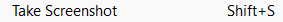

# EscreenshotTaker

Simple screenshot maker.

### Usage

1. Place the script in your project's Scripts folder.
2. To take a screenshot, navigate to Escripts -> Take Screenshot in the menu bar or use the shortcut Shift+S.
3. Find your screenshots in the Assets/Screenshots directory.

The script functions both during Play Mode and in the Editor, capturing the Game window.
